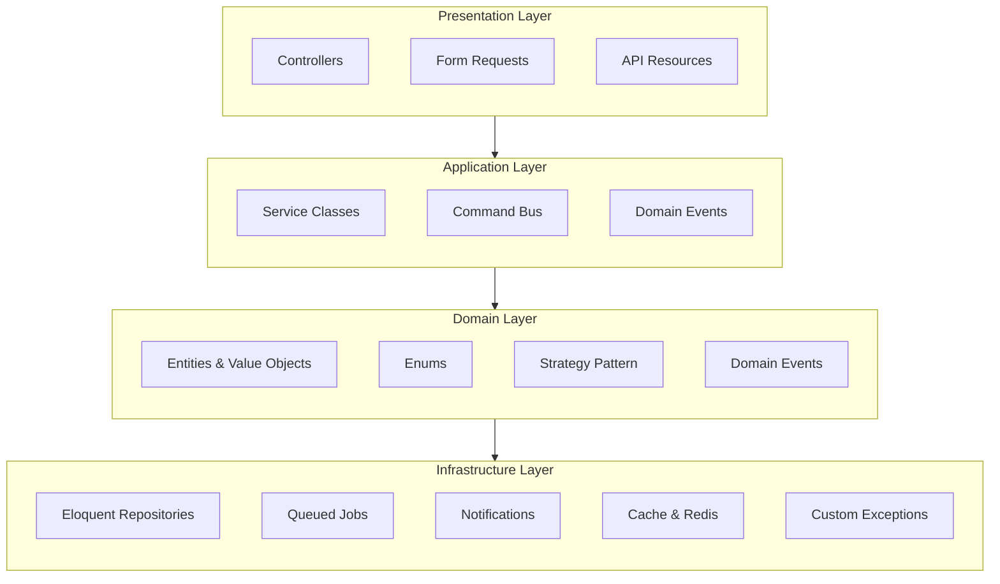

# Loan Management API

[](https://laravel.com)
[](https://php.net)
[](https://docker.com)
[](https://github.com)
[](https://opensource.org/licenses/MIT)
[](https://phpunit.de)

A **production‑ready** loan management system built with **Laravel 12**.  
It covers the full loan lifecycle—from application and disbursement to repayment and collections—while following modern PHP and Laravel best practices.

---

## Table of Contents

- [Overview](#overview)
- [Architecture](#architecture)
- [Features](#features)
- [Tech Stack](#tech-stack)
- [Setup Instructions](#setup-instructions)
- [API Documentation](#api-documentation)
- [Testing](#testing)
- [Project Structure](#project-structure)
- [Roadmap](#roadmap)
- [License](#license)
- [Author](#author)
- [Acknowledgements](#acknowledgements)

---

## Overview

This API powers a full‑featured loan management platform serving two primary user groups:

- **Borrowers** – self‑service loan applications, repayments, document uploads, and account statements.  
- **Staff** – loan officers, supervisors, collectors, administrators, and system administrators with role‑based access.

The system is built on a **modular, layered architecture** that isolates concerns, making the codebase easy to understand, extend, and test.

---

## Architecture

The application follows a clean, four‑layer architecture:



### Layer Responsibilities

| Layer | Purpose | Typical Components |
|-------|---------|--------------------|
| **Presentation** | Handles HTTP requests/responses, validation, and serialization | Controllers, Form Requests, API Resources |
| **Application** | Orchestrates use‑cases, coordinates domain services | Service classes, Commands, Event listeners |
| **Domain** | Pure business logic, rules, and value objects | Entities, Value Objects, Enums, Strategies, Domain Events |
| **Infrastructure** | Persistence, external services, queueing, caching | Eloquent Repositories, Jobs, Notifications, Cache adapters |

**Key Patterns**

- **Repository Pattern** – abstracts data access (e.g., `NegotiationRepository`).
- **Domain Events** – decouples side effects such as audit logs and notifications.
- **Strategy Pattern** – encapsulates interchangeable algorithms (e.g., `DiscountStrategy`, `ExtensionStrategy`).
- **Value Objects** – encapsulate validation and behavior (e.g., `Money`, `ExpirationWindow`).

This separation enables feature additions, rule changes, or infrastructure swaps without touching core logic.

---

## Features

### Authentication & Authorization
- Multi‑guard authentication (borrowers & staff) via Laravel Sanctum
- Email verification (`MustVerifyEmail`)
- Fine‑grained role‑based access (admin, loan_officer, officer, moderator, cashier, supervisor, manager, collector, system)

### Loan Products
- Full CRUD for loan products (admin/moderator)
- Configurable parameters: amount range, interest rate, tenure, required documents, late fees

### Loan Applications
- Borrower drafts, submission, document upload, cancellation
- Staff review, assignment, approval, rejection, disbursement
- Full status lifecycle: `draft → submitted → under_review → approved → rejected → cancelled → disbursed → closed`

### Credit Checks
- Internal scoring algorithm (0‑1000) based on borrower data
- Mock external bureau integration
- Daily rate limiting to protect external services

### Disbursement & Repayment
- Automatic loan account creation with amortisation schedule
- Recording of full/partial payments with principal/interest split
- Tiered late‑fee application (10% / 15%)

### Collections / Receivables
- Overdue installment listing with filtering
- Late‑fee waivers governed by business rules
- Automated collection reminders (email)
- Loan default management (automatic & manual)
- Loan restoration workflow
- Negotiations (discount, extension, settlement, new schedule) with expiration and enforcement

### Reporting & Analytics
- Cached dashboard metrics with health score
- Paginated, filterable approved‑loans list
- NPA (Non‑Performing Assets) report
- Aging report (0‑30, 31‑60, 61‑90, 90+ days)
- Excel exports for approved loans and NPA

### Document Management
- Secure upload, listing, and download (signed URLs)
- Staff verification workflow
- Virus scanning via VirusTotal
- Automatic image thumbnails (GD/Intervention)
- Versioning: soft‑delete + replacement on update

### Scheduled Jobs (Cron)
- Daily reminders (3 days before due, due today)
- Overdue marking & late‑fee application
- Weekly report generation
- Monthly statement generation
- Expiring negotiation monitoring
- Enforcement of expired negotiations (auto‑default)

### Performance & Infrastructure
- Redis for caching, rate limiting, and queueing
- Docker‑Compose setup (PHP, Nginx, MySQL, Redis)
- API versioning (v1)
- Queue workers for background jobs
- Comprehensive test suite (PHPUnit)

---

## Tech Stack

| Component          | Technology                              |
|--------------------|-----------------------------------------|
| **Framework**      | Laravel 12.x                            |
| **Language**       | PHP 8.2+                                |
| **Database**       | MySQL 8                                 |
| **Cache / Queue**  | Redis 7 (predis/predis)                 |
| **Containerisation**| Docker & Docker Compose                |
| **Authentication** | Laravel Sanctum                         |
| **Excel Export**   | Maatwebsite/Excel                       |
| **Image Processing**| Intervention Image (GD)                |
| **Notifications**  | Mail (Mailhog / Log)                    |
| **Testing**        | PHPUnit (Feature + Unit)                |

---

## Setup Instructions

> **Prerequisites**
> - Docker & Docker Compose
> - Git

### 1. Clone the Repository
```bash
git clone https://github.com/bayram1290/showcase.git
cd showcase
```

### 2. Environment Setup
```bash
cp .env.example .env
```
Edit `.env` to configure:
- Database connection (`DB_HOST`, `DB_PORT`, `DB_DATABASE`, `DB_USERNAME`, `DB_PASSWORD`)
- Redis connection (`REDIS_HOST`, `REDIS_PORT`, `REDIS_PASSWORD`)
- Mail driver (Mailhog for local, SMTP for production)
- VirusTotal API key (if enabling virus scanning)
- Any other API keys or secrets

### 3. Build & Start Containers
```bash
docker compose up -d
```

### 4. Install PHP Dependencies
```bash
docker exec -it demo_a_php composer install
```

### 5. Generate Application Key
```bash
docker exec -it demo_a_php php artisan key:generate
```

### 6. Run Migrations & Seeders
```bash
docker exec -it demo_a_php php artisan migrate --seed
```
> This creates the database schema and populates essential lookup data (roles, permissions, etc.).

### 7. Start the Queue Worker (for scheduled jobs & async tasks)
```bash
docker exec -it demo_a_php php artisan queue:work --daemon &
```
> For production, consider supervisord or a process manager.

### 8. Access the API
The API is available at:
```
http://localhost/api/v1
```
- **Borrower login:** `/api/v1/borrower/login`
- **Staff login:** `/api/v1/user/login`

### 9. (Optional) Run Tests
```bash
docker exec -it demo_a_php php artisan test
```

---

## API Documentation

A Postman collection is provided in the `docs/` folder. Import it into Postman or any compatible API client to explore and test all endpoints.

- **Base URL:** `http://localhost/api/v1`
- **Authentication:** Bearer token obtained from the login endpoints (`/borrower/login` or `/user/login`).

---

## Testing

The test suite covers:

- Authentication flows (borrower & staff)
- Loan application lifecycle (create → submit → approve → disburse)
- Credit checks (internal & external mock)
- Repayment recording & late‑fee logic
- Collections (overdue, waivers, negotiations, defaults, restoration)
- Reporting endpoints (approved loans, NPA, aging)
- File upload, virus scanning, thumbnail generation
- Queue jobs and scheduled commands

Run the full suite with:
```bash
docker exec -it demo_a_php php artisan test
```

---

## Project Structure (Simplified)

```
├── app/
│   ├── Domain/               # Core business logic (Entities, Value Objects, Enums, Strategies, Events)
│   ├── Application/          # Use‑case orchestration (Services, Commands, Event listeners)
│   ├── Infrastructure/       # Persistence, jobs, notifications, cache
│   ├── Http/                 # Controllers, Form Requests, API Resources
│   └── Models/               # Eloquent models
├── config/
│   ├── receivables.php       # Collections‑specific configuration
│   └── helper.php            # Shared helpers & constants
├── database/
│   ├── migrations/           # DB schema
│   └── seeders/              # Test & demo data
├── routes/
│   └── api.php               # Versioned API routes (v1)
├── docs/                     # Postman collection & API docs
├── tests/                    # Feature & Unit tests
├── docker-compose.yml
└── Dockerfile
```

---

## Roadmap

- [x] Multi‑guard authentication (Sanctum)
- [x] Loan products & applications
- [x] Credit checks (internal + mock bureau)
- [x] Disbursement & repayment
- [x] Collections / Receivables module
- [x] Document management (upload, verify, scan, versioning)
- [x] Reporting & Excel exports
- [x] API versioning (v1)
- [ ] API documentation (OpenAPI/Swagger) – replace Postman collection
- [ ] Centralised Import/Export engine (bulk loan upload/download)
- [ ] Extensive test coverage (target >90%)
- [ ] UI dashboard (admin panel) using Livewire or Vue
- [ ] Multi‑currency support
- [ ] Advanced analytics & forecasting

---

## License

This project is open‑source and licensed under the [MIT License](LICENSE).

---

## Author

**Bayramgeldi Matiyev**  
GitHub: [@bayram1290](https://github.com/bayram1290)

---

## Acknowledgements

- [Laravel](https://laravel.com) – The PHP framework for web artisans
- [Spatie Laravel‑Permission](https://github.com/spatie/laravel-permission) – Role & permission management
- [Intervention Image](https://image.intervention.io/) – Image handling
- [Maatwebsite/Laravel‑Excel](https://laravel-excel.com/) – Excel/CSV import/export
- [Laravel Sanctum](https://laravel.com/docs/sanctum) – API authentication
- [Redis](https://redis.io/) – Cache, queue, and rate‑limiting backend
- [Docker](https://www.docker.com/) – Containerisation platform
- The open‑source community for countless packages and inspiration

---

*Happy lending!* 🚀